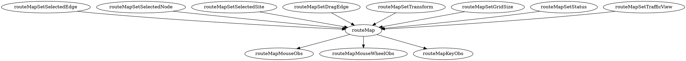
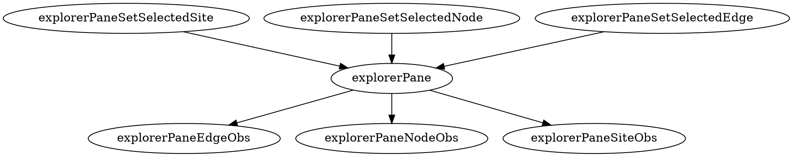
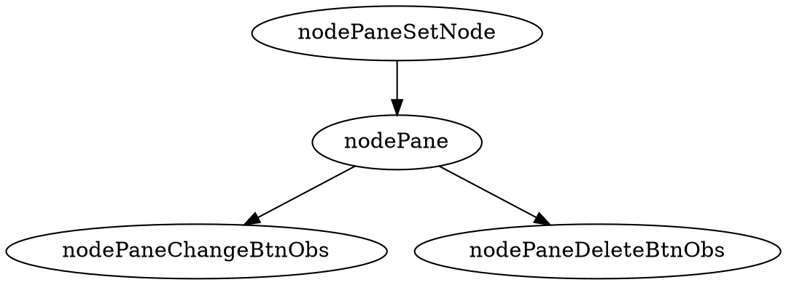
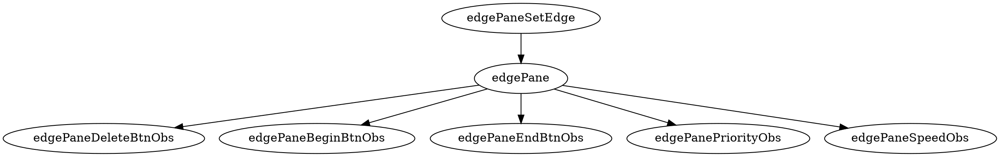
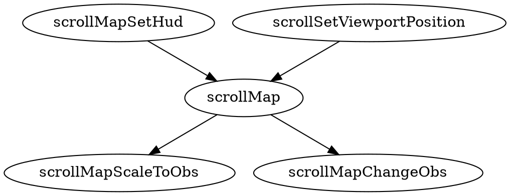
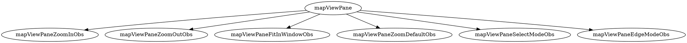
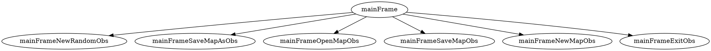
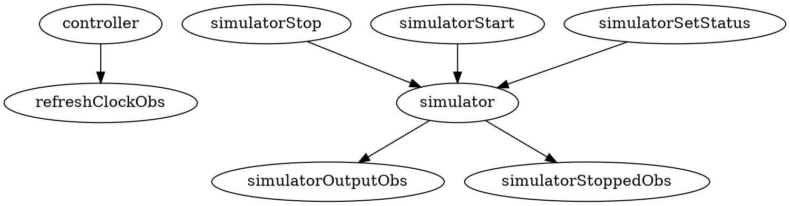
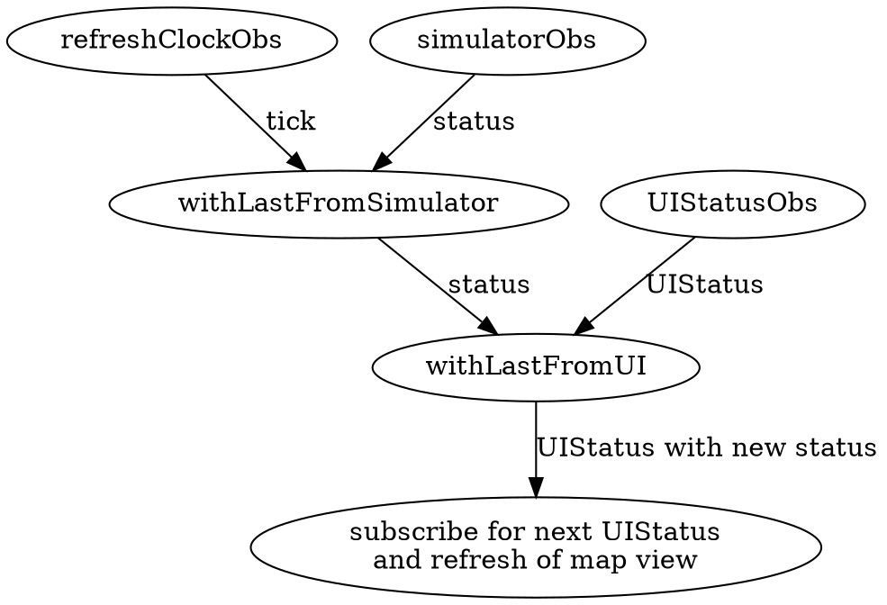
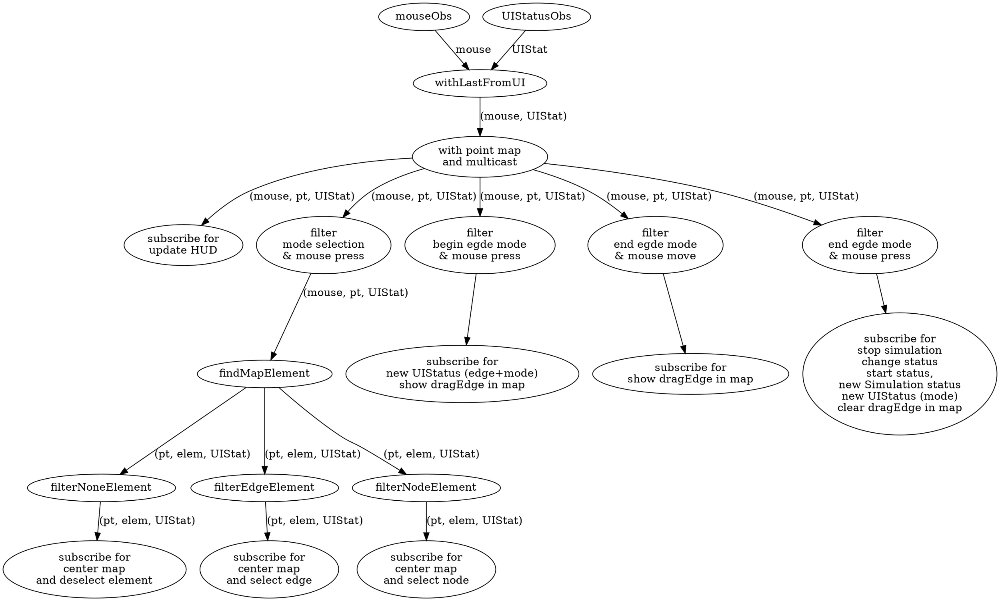

# Observables

---

---

---

---

---

---

---

## Processes

- Mouse site selection
- Mouse node selection
- Mouse edge selection
- Mouse map centering
- Mouse scale
- Mouse edge insert/change
- Mouse module insert
- Mouse data HUD

- Explorer site selection
- Explorer node selection
- Explorer edge selection

- Node Panel node delete menu
- Node Panel node change menu

- Edge Panel edge delete menu
- Edge Panel edge change begin node menu
- Edge Panel edge change end node menu
- Edge Panel edge change properties

- Map View Pane zoom in menu
- Map View Pane zoom out menu
- Map View Pane zoom fit menu
- Map View Pane zoom reset menu
- Map View Pane selection mode menu
- Map View Pane edge insert menu
- Map View Pane module insert menu
- Map View Pane map view menu
- Map View Pane traffic view menu

- Mainframe new map menu
- Mainframe new random map menu
- Mainframe open map menu
- Mainframe save map menu
- Mainframe save as map menu
- Mainframe exit menu
- Mainframe start simulation menu
- Mainframe stop simulation menu
- Mainframe speed simulation menus
- Mainframe randomize menu
- Mainframe traffic info menu
- Mainframe weights menu
- Mainframe difficult menu
- Mainframe optimization menu

### Clock tick

### Mouse operations

The processes include:

- Mouse site selection
- Mouse node selection
- Mouse edge selection
- Mouse map centering
- Mouse scale
- Mouse edge insert/change
- Mouse module insert
- Mouse data HUD

If the route map is in selection mode when click an element point in map
it selects the element and also the element in explorer panel and shows the details.
If there is no element at clicked point the map is centered at point updateing the viewport location and deselecting any element on the map and explorer panel.

If the route map is in inserting edge mode on the first mouse press the begin point of new edge snapping the position to the nearest node is marked.
On any mouse movement the edge silhouette is drawn snapping the end position to the nearest node.
On next mouse press the new edge is created.

If the route map is in inserting module mode on the first mouse press  the module center point is marked.
On any mouse movement the module silhouette is drawn rotating the module toward the mouse deirection.
On next mouse press the new module is created.

On mouse wheel rotation the map is scaled in or out updateding the route map and the HUD.

Any mouse movement update the HUD view that change on the selection mode.

The actions are synchronized on:

- refreshClock for painted status
- last change mode on route map,
- last viewport change and scale change
- mouse press or click or move or wheel move

