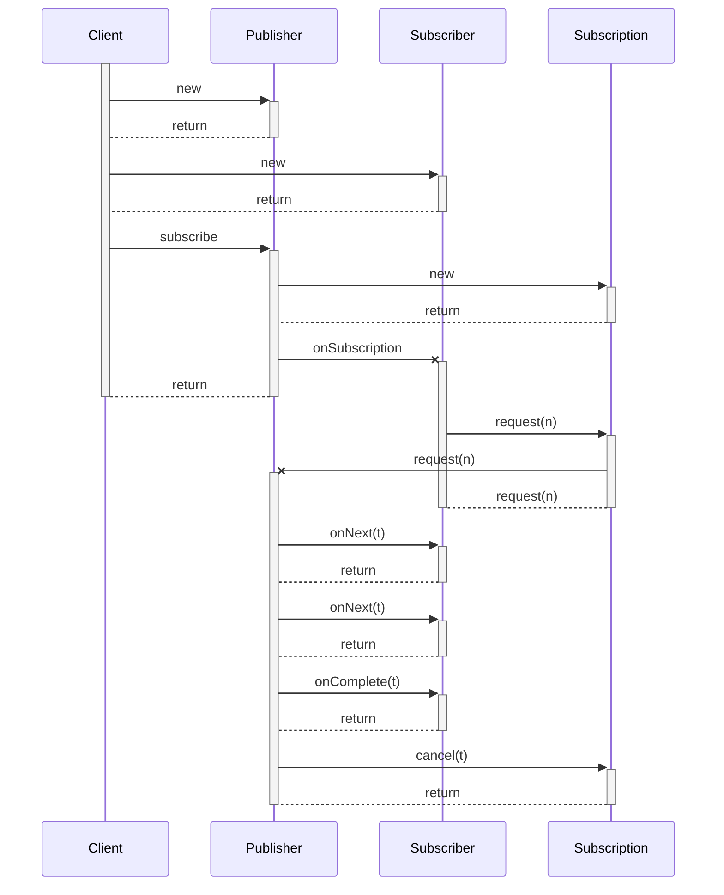

# Reactive

Publisher-->Client: 

Subscriber->>Subscription: request(n)

activate Subscription
Subscription->>Publisher: request(n)
deactivate Subscription
activate Publisher
Publisher->>Subscriber: onNext(t)
Publisher->>Subscriber: onNext(t)
Publisher->>Subscriber: onComplete(t)
Publisher->>Subscription: cancel(t)

deactivate Publisher

